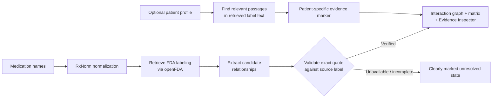
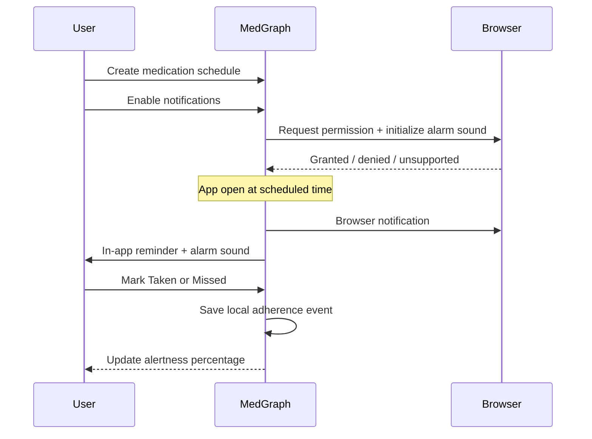

# MedGraph

> Evidence behind every medication connection.

MedGraph is a Next.js medication-safety information workspace. It helps people explore potential medication relationships using RxNorm normalization, FDA-submitted drug labeling from openFDA, and evidence validation that keeps displayed quotes traceable to their source.

> [!IMPORTANT]
> MedGraph is an information and review tool—not a diagnosis, prescribing, or dose-calculation service. Do not start, stop, or change medication based on this app. Discuss medication questions with a pharmacist or qualified healthcare professional.

## What it does

| Area | Capability |
| --- | --- |
| Medication analysis | Normalize up to 5 medication names, retrieve available labeling, and identify evidence-backed pair relationships. |
| Evidence review | Inspect exact quotes, relevant label section, source metadata, and verification details. |
| Visual analysis | Explore the interaction network and a clickable interaction matrix / heatmap. |
| Patient profile | Optionally store age, weight, pregnancy, kidney/liver conditions, allergies, and notes. Profile warnings only appear when retrieved label text is relevant. |
| Medication routine | Create local schedules, see a daily timeline and frequency chart, enable alerts, and mark reminders as taken or missed. |
| History & reports | Save analysis runs locally, restore them later, and export a review-ready evidence report. |

## How the evidence pipeline works



### Reading results responsibly

- **🔴 Potential safety signal** — relevant source evidence was found for a medication relationship.
- **🟢 No documented signal found** — no explicit pairing was identified in the checked available label text; this is not a confirmation that a combination is safe.
- **🟠 Patient-specific warning** — the retrieved label contains information relevant to an entered profile field. It signals review, not a medical conclusion.
- **Gray / unavailable** — a usable source was unavailable or the evidence extraction step did not complete. This does not mean the medications are safe together.

## Medication schedules and reminders

Schedules are stored in browser `localStorage` and work independently from an analysis. Notifications are requested **only** after the user clicks **Enable notifications**.



### Reminder limitations

- Reminders run while MedGraph is open in an active browser context.
- A fully closed browser cannot reliably produce client-only notifications; that requires a service-worker/push-notification backend.
- Browser permission, sound playback, and notification behavior can vary by browser and device settings.

## Quick start

### Requirements

- Node.js 20 or newer
- npm
- A Gemini API key for live extraction (optional when using Demo Mode)

### Install and run

```bash
npm install
cp .env.example .env.local
```

Add your key to `.env.local`:

```dotenv
GEMINI_API_KEY=your_key_here
```

Then start the app:

```bash
npm run dev
```

Open [http://localhost:3000](http://localhost:3000).

### Demo Mode

Enable **Use Demo Data** in the app to explore captured, validated examples without a Gemini key or live API calls. The bundled demo includes representative Warfarin, Aspirin, and Ibuprofen data.

## Available commands

```bash
npm run dev     # Start the local development server
npm run lint    # Run ESLint
npm run build   # Create a production build
npm run start   # Serve a production build
```

## Privacy and storage

MedGraph does not require an account. The patient profile, medication schedules, reminder outcomes, and history are stored locally in the browser. Analysis requests send the selected medication names and, when provided, the optional profile fields required for that run.

## Technology

- Next.js + React + TypeScript
- Tailwind CSS
- RxNorm normalization
- openFDA labeling retrieval
- Gemini-assisted extraction with server-side quote validation
- Local browser storage for history, schedules, and reminder outcomes

## Deployment

Deploy as a standard Next.js application. When deploying, configure `GEMINI_API_KEY` in your host's environment-variable settings. Never commit `.env.local` or API keys to the repository.

---

Built to make medication-label evidence easier to inspect and discuss.
